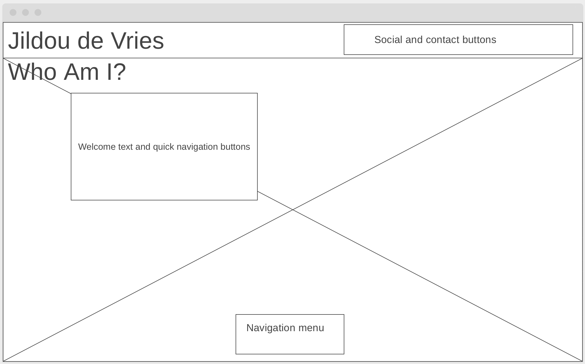
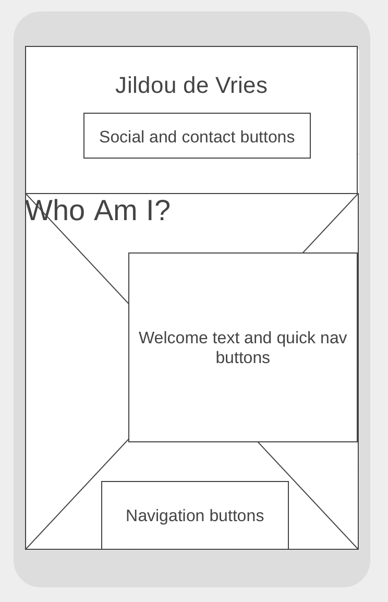

# Jildou de Vries photography and projects website

## User Experience (UX)
This website aims to give potential clients an impression of my capacities as both a programmer and a photographer.

### User stories
* First time visitor goals
	* As a first time visitor, I want to get a clear impression on landing. 
	* As a first time visitor, I also want a clear and simple navigation.
	* As a first time visitor, I want to have an easy way to contact the service.
	* As a first time visitor that is in need of an event photographer, I want to see sharp picture without too many distractions. Pictures should speak for themselves.
	* As a first time visitor that is a hiring manager for software developer positions I want to see a well argued portfolio.
* Returning visitor goals
	* As a returning visitor I want to have an easy way to contact the services.

### Design
* Colour scheme
	* The main colours is a soft pink. The other colours used are mainly grayscale.
* Typography
	* The main font used Rubik, which falls back onto sans-serif if unavailable. Share Tech Mono for the logo heading, falling back onto monospace if unavailable.
* Imagery
	* The website relies heavily on images. I used my own photography in most spaces.
	* The portrait picture used on the 'about me' page, is taken by the talented [Ann Charlotte Voie](http://anncharlottevoie.com)

### Wireframes
| Homepage desktop | Homepage mobile |
| ---------------- | --------------- |
|  |  |

* Mobile wireframes - [view](https://github.com/jildourixt/second-website/tree/master/assets/wireframes/mobile)
* Desktop wireframes - [view](https://github.com/jildourixt/second-website/tree/master/assets/wireframes/desktop)

## Features
* Responsive on mobile and tablet as well as desktop sizes.
* The photography page has an intentional side scroll on desktop size. On mobile device sizes the pictures are displayed vertically stacked.
* The positioning of the wiggling contact buttons in desktop mode is intentional. The bottom border over the header line was a style choice. 
* Navigation menu is intentionally at the bottom of the page, taking into consideration that the majority of users is expected to be using a mobile device. This provides easy access. The navigation bar is designed to be minimal and non-intrusive. On the photography page it allows the images to be displayed as big as possible while being non-intrusive and blending in. 

## Technologies used

### Languages used
* [HTML5](https://en.wikipedia.org/wiki/HTML5)
* [CSS3](https://en.wikipedia.org/wiki/Cascading_Style_Sheets)
* [JavaScript](https://en.wikipedia.org/wiki/JavaScript)

### Frameworks, Libraries & Programs 
* [Google Fonts](https://fonts.google.com/)
	* Goole Fonts were used to import both the Rubik as well as the Share Tech Mono font into the style.css file. This is used on all pages of the project.
* [Font Awesome](https://fontawesome.com/)
	* Font Awesome was used for the icon elements in the navigation bar in the footer as well as the social media and contact buttons in the header.
* [Git](https://git-scm.com/)
	* Git was used for version control throughout the whole project by using Github Desktop as well as command lines. 
* [Github](https://github.com/)
	* Github is used to store the projects code after being pushed from Git.
* [Wireframes|cc](https://wireframe.cc)
	* Wireframes|cc was used for creating the wireframes for this website.

## Testing

Testing was done through W3C markup Validator and the W3C CSS Validator Services. All pages were tested and validated without errors. 

* [W3C Markup Validator](https://jigsaw.w3.org/css-validator/#validate_by_input)
* [W3C Nu HTML Checker](https://validator.w3.org/nu/#textarea)

### Testing user stories from User Experience Section
* First time visitor goals
	* As a first time visitor, I want to get a clear impression on landing.
		* The landing page gives a short description of what the website it about. In addition to the site wide navigation menu, quick buttons to see photographs or projects are displayed. This makes for quick navigation.
	* As a first time visitor, I want to have an easy way to contact the service.
		* The landing page, as well as all other pages have quick buttons to social media platforms. All pages also hold buttons for direct calls to action for phone calls or emails. These buttons are given emphasise through 
	* As a first time visitor that is in need of an event photographer, I want to see sharp picture without too many distractions. Pictures should speak for themselves.
		* The photographs page is easily navigated to and is responsively optimised for each device type. On desktop, the images are displayed horizontally with a side scroll. On mobile display they are stacked vertically.
	* As a first time visitor that is a hiring manager for software developer positions I want to see a well balanced.
		* A portfolio of finished projects is displayed here. The design shows the logo of the project, along with a short description of it. Each project also has a link to visit the project online, and, for portfolio purposes, a link to the GitHub repository of the project.
* Returning visitor goals
	* As a returning visitor I want to have an easy way to contact the services.
		* The contact buttons that are linked to phone and email are easily accessible on the top of the page.

### Further testing
* The website was tested on Safari and Google Chrome browsers.
* The website was tested on a variety of devices, including Desktop, iPhone 8, iPhone X.
* All linkages were tested to make sure they link to the right pages and content.
* Accessibility was tested by making sure all the images have alt information.

## Deployment
### GitHub Pages

The project was deployed to GitHub Pages using the following steps...
1. Log in to GitHub and locate the [GitHub Repository](https://github.com/jildourixt/second-website.git)
2. At the top of the Repository (not top of page), locate the "Settings" Button on the menu.
4. Scroll down the Settings page until you locate the "GitHub Pages" Section.
5. Under "Source", click the dropdown called "None" and select "Master Branch".
6. The page will automatically refresh.
Scroll back down through the page to locate the now published site link in the "GitHub Pages" section.

### Forking the GitHub Repository

By forking the GitHub Repository we make a copy of the original repository on our GitHub account to view and/or make changes without affecting the original repository by using the following steps...

1. Log in to GitHub and locate the [GitHub Repository](https://github.com/jildourixt/second-website.git)
2. At the top of the Repository (not top of page) just above the "Settings" Button on the menu, locate the "Fork" Button.
3. You should now have a copy of the original repository in your GitHub account.

### Making a Local Clone

1. Log in to GitHub and locate the [GitHub Repository](https://github.com/jildourixt/second-website.git)
2. Under the repository name, click "Clone or download".
3. To clone the repository using HTTPS, under "Clone with HTTPS", copy the link.
4. Open Git Bash
5. Change the current working directory to the location where you want the cloned directory to be made.
6. Type git clone, and then paste the URL you copied in Step 3.
``` 
$ git clone https://github.com/jildourixt/second-website.git
```
7. Press Enter. Your local clone will be created.

## Credits
### Content
Credits and a massive thanks to [W3Schools](https://www.w3schools.com/howto/howto_js_scroll_to_top.asp) for teaching me how to implement the back to top button.
### Media
Portrait and index page background were taken by the great [Ann Charlotte Voie](www.anncharlottevoie.com
). All other pictures were taken by the developer.
### Acknowledgements
* My mentor for continuous helpful feedback.
* Tutor support at Code Institute for their support and materials.